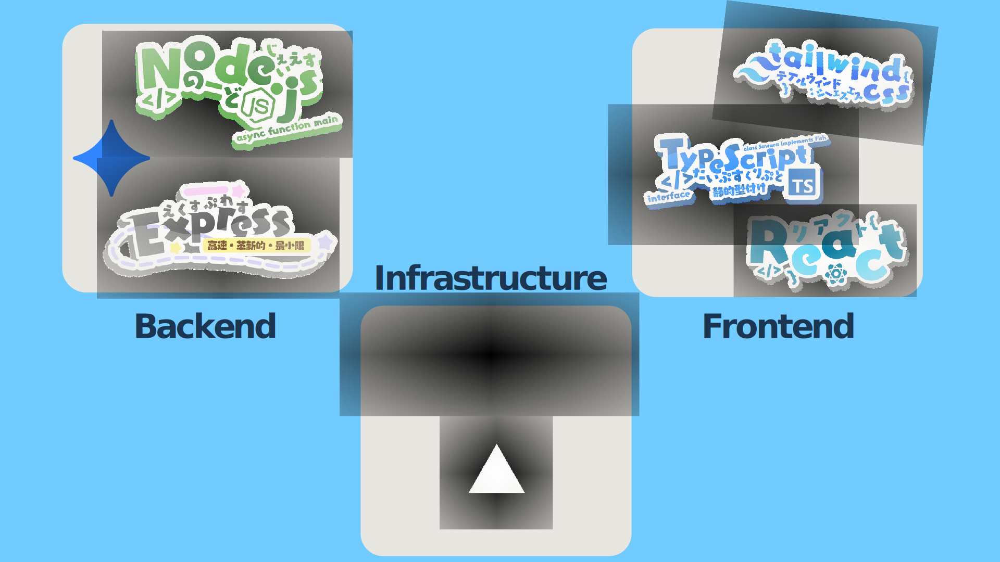

# NANIMONO
## 本アプリケーションの概要
**「初対面の人同士の気まずい雰囲気や，その時の役割分担の難しさ」という世の中の当たり前を解決する，Webアプリケーションです．**

初対面の人同士が手軽かつ短時間で、お互いの役割を把握できるサービスです．
代表者が人数を入力して共有リンクを作成し，各メンバーが簡単な質問に答えるだけで，自分の役割を示唆するキャラクターが表示されます．
キャラクターの説明は抽象的に表現されているため，アイスブレイクやチームビルディングなど様々な状況で活用できます．
サービスが提示する簡易的な助言によって，その後の円滑なコミュニケーションを促進します．
### 受賞歴
本プロジェクトは，[RSS Hackathon 2025 Beyond](https://race-ss.co.jp/hackathon/2025/) にて，**奨励賞**を受賞しました．
## ローカル環境での実行方法
1. 新しくTerminalを起動し，バックエンドサーバーを立ち上げる．
```bash
# ./backend 直下に移動
cd ./backend
# 必要なパッケージのダウンロード（初回のみ）
npm install
# サーバー立ち上げ
npm run start
```
2. 新しくTerminalを起動し，フロントエンドサーバーを立ち上げる．
```bash
# ./frontend 直下に移動
cd ./frontend
# 必要なパッケージのダウンロード（初回のみ）
npm install
# サーバー立ち上げ
npm run dev
```
3. フロントエンドのローカルサーバー（https://localhost:5173/）にアクセスし，作業を行う．
## 技術スタック


<table>
    <tr>
        <td rowspan="2">
            Frontend
        </td>
        <td>
            Language
        </td>
        <td>
            TypeScript
        </td>
    </tr>
    <tr>
        <td>
            Framework
        </td>
        <td>
            React, Tailwind CSS
        </td>
    </tr>
    <tr>
        <td rowspan="2">
            Backend
        </td>
        <td>
            Language
        </td>
        <td>
            JavaScript
        </td>
    </tr>
    <tr>
        <td>
            Framework
        </td>
        <td>
            Node.js (Express), Gemini
        </td>
    </tr>
    <tr>
        <td 
        colspan="2"
        >
        Infrastructure
        </td>
        <td>
            Render
        </td>
    </tr>
</table>