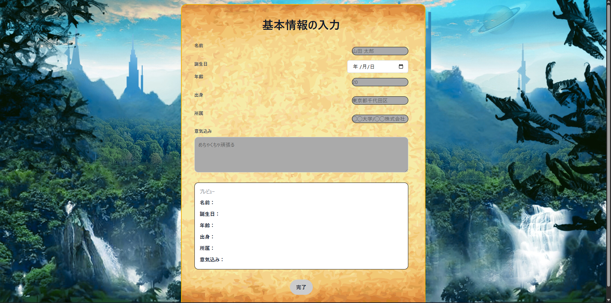
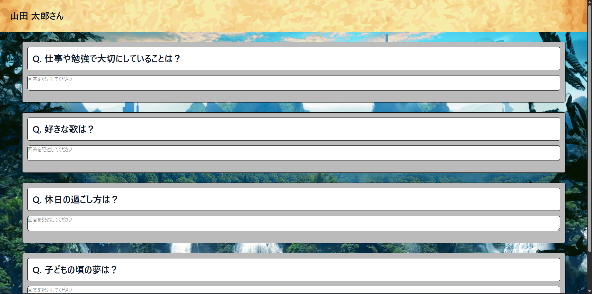
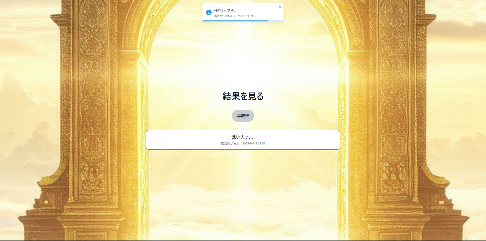
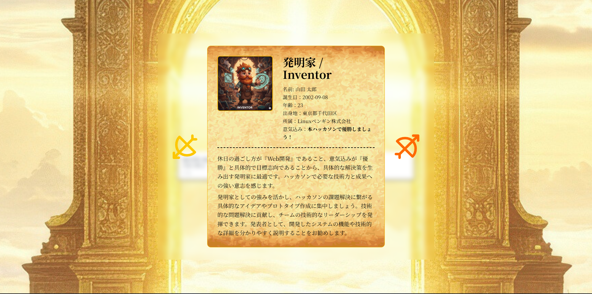

# NANIMONO
## 本アプリケーションの概要
**「初対面の人同士の気まずい雰囲気や，その時の役割分担の難しさ」という世の中の当たり前を解決する，Webアプリケーションです．**

初対面の人同士が手軽かつ短時間で、お互いの役割を把握できるサービスです．
代表者が人数を入力して共有リンクを作成し，各メンバーが簡単な質問に答えるだけで，自分の役割を示唆するキャラクターが表示されます．
キャラクターの説明は抽象的に表現されているため，アイスブレイクやチームビルディングなど様々な状況で活用できます．
サービスが提示する簡易的な助言によって，その後の円滑なコミュニケーションを促進します．
### 受賞歴
本プロジェクトは，[RSS Hackathon 2025 Beyond](https://race-ss.co.jp/hackathon/2025/) にて，**奨励賞**を受賞しました．
## ローカル環境での実行方法
1. ./frontend直下に，以下の内容の.envファイルの作成
```txt
VITE_API_URL=http://localhost:3000
GEMINI_API_KEY=""
PORT=3000
NODE_ENV=development
CORS_ORIGIN="http://localhost:3000"
```
2. ./backend直下に，以下の内容の.envファイルの作成
```txt
GEMINI_API_KEY=""
PORT=3000
NODE_ENV=development
CORS_ORIGIN="http://localhost:5173"
```
3. 新しくTerminalを起動し，バックエンドサーバーを立ち上げる．
```bash
# ./backend 直下に移動
cd ./backend
# 必要なパッケージのダウンロード（初回のみ）
npm install
# サーバー立ち上げ
npm run start
```
4. 新しくTerminalを起動し，フロントエンドサーバーを立ち上げる．
```bash
# ./frontend 直下に移動
cd ./frontend
# 必要なパッケージのダウンロード（初回のみ）
npm install
# サーバー立ち上げ
npm run dev
```
5. フロントエンドのローカルサーバー`http://localhost:5173/`にアクセスし，作業を行う．
## 技術スタック
### 主要なもの

### 詳細Ver
<table>
    <tr>
        <th colspan="2">
            Category
        </th>
        <th>
            Tech Stack
        </th>
    </tr>
    <tr>
        <td rowspan="2">
            Frontend
        </td>
        <td>
            Language
        </td>
        <td>
            TypeScript
        </td>
    </tr>
    <tr>
        <td>
            Framework
        </td>
        <td>
            React, Tailwind CSS
        </td>
    </tr>
    <tr>
        <td rowspan="2">
            Backend
        </td>
        <td>
            Language
        </td>
        <td>
            JavaScript
        </td>
    </tr>
    <tr>
        <td>
            Framework
        </td>
        <td>
            Node.js, Express
        </td>
    </tr>
    <tr>
        <td 
        colspan="2"
        >
        Infrastructure
        </td>
        <td>
            Render
        </td>
    </tr>
    <tr>
        <td 
        colspan="2"
        >
        External Services
        </td>
        <td>
            Gemini
        </td>
    </tr>
</table>

## デモ
1. ホーム画面

2. ホーム画面（URL表示）

3. ホーム画面（URLのコピー時）

4. 基本情報入力ページ

5. 基本情報入力の一例

6. 質問が表示されます

7. 回答例

8. 結果表示前待機ページ

9. 全員が質問を答え終えるまでは，結果表示ページには遷移しません

10. 結果表示ページ

